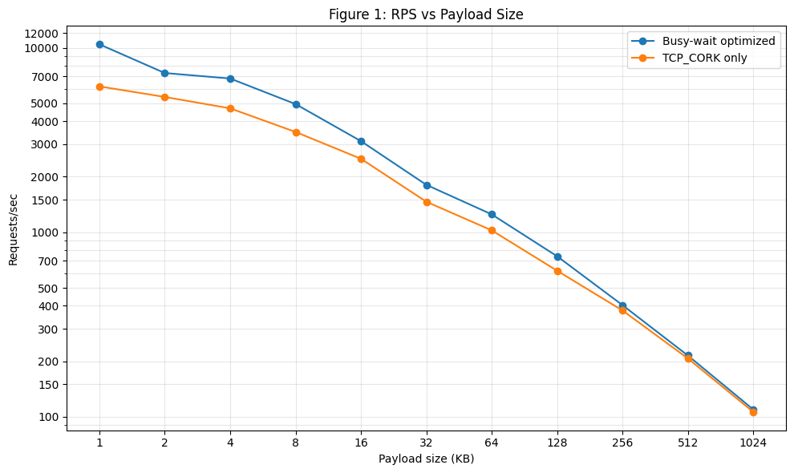
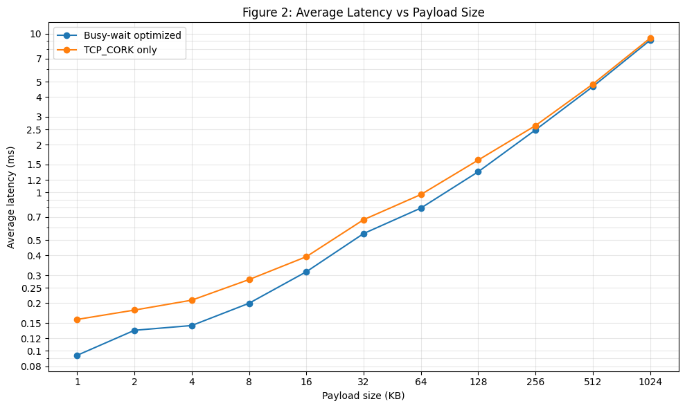
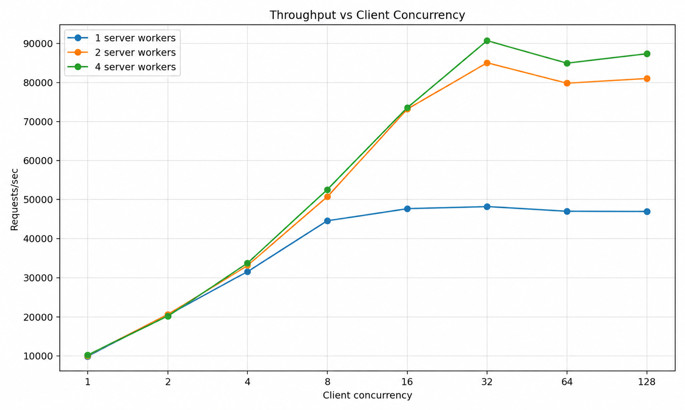
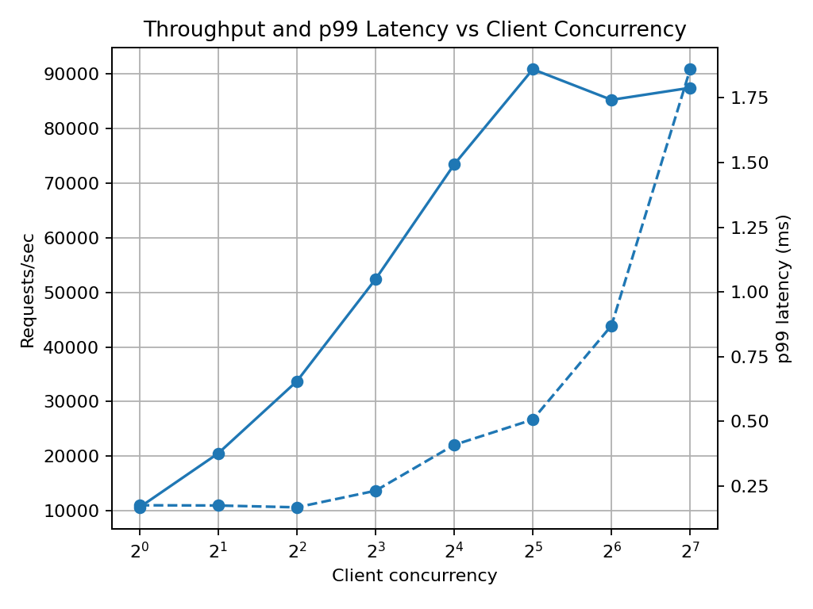

# Minimal C Web Server

This repo implements an **event loop based** HTTP/1.1 static web server in **C** and closed loop benchmarks it over ethernet (1000Mbps) using wrk. Latency/Throughput curves are plotted against number of connections/concurrency and file sizes. Optimizations: Spinning epoll_wait, TCP_CORK are implemented. Max throughput obtained was 90k rps, 0.5ms p99. Effects of optimizations are studied via latency breakdown using bpftrace. Future work could identify source of queueing/bottleneck possibly through open loop benchmarking.

## Setup

Server and client on separate laptops connected via 1000Mbps ethernet cable.
### Server
- **Master + workers:** a master process with multiple workers. Master accepts connections and round robin dispatches to workers. Worker process CPU affinity set to non SMT siblings.
- **I/O model:** each worker runs a non-blocking **epoll** event loop and registers non-blocking client TCP sockets.
- **Serving static files:** on HTTP GET requests, files are opened, verified, and streamed with **`sendfile()`**.
- **Optimizations:** 
  - Busy waiting epoll_wait to reduce wake up time. Also reduced send path latency. Maybe due to higher CPU GHz and increased cache effects. Observed by bpftrace, perf stat.
  - TCP_CORK to prevent small header send and delayed ACK, and to immediately push data to TCP socket send queue.
### Client

Patched/modified `wrk` is used for generating load. 

`Wrk patch`: rebuilt wrk with "coordination ommision compensation (stats_correct())" commented out/removed. Original wrk was adding synthetic latency observations to simulate arrival of requests during large latency spikes in serving pending request. This breaks the closed loop assumption. Patched `wrk` reports unmodified latency statistics.

This behaviour has been discussed by other members such as [upstream wrk issue #485](https://github.com/wg/wrk/issues/485) and [issue #438](https://github.com/wg/wrk/issues/438), which questions the correctness of wrk's coordinated-omission compensation.

## Benchmarking
Forge is benchmarked with patched/modified `wrk` over ethernet. 

We first study single client connection, single server worker. We compare busy waiting vs without. Then we keep busy polling and scale concurrent connections and server workers.

### Single client connection, single server worker. 

<p align="center">
  <b>Single Connection Latency/Throughput vs File Size</b>
</p>
<p align="center">
  
</p>
<p align="center">
  
</p>

As file size increases, work per request for file increases, hence latency increases and throughput decreases.
Busy waiting improves performance. Especially for small files. For 1KB, (latency, throughput): (158us, 6.1k) -> (94us, 10.4k). However, streaming latency dwarfs gains due to busy waiting for larger sizes. Numerical values are provided below.

| file_size_bytes | RPS TCP_CORK only | RPS optimized | avg latency TCP_CORK only ms | avg latency optimized ms | p99 latency TCP_CORK only ms | p99 latency optimized ms |
| --------------- | ----------------- | ------------- | ---------------------------- | ------------------------ | ---------------------------- | ------------------------ |
| 1,024           | 6,173.58          | 10,436.98     | 0.158                        | 0.094                    | 0.252                        | 0.148                    |
| 2,048           | 5,411.52          | 7,293.97      | 0.181                        | 0.135                    | 0.286                        | 0.233                    |
| 4,096           | 4,694.45          | 6,810.81      | 0.209                        | 0.145                    | 0.287                        | 0.222                    |
| 8,192           | 3,497.12          | 4,951.54      | 0.282                        | 0.200                    | 0.403                        | 0.251                    |
| 16,384          | 2,502.80          | 3,119.01      | 0.393                        | 0.316                    | 0.535                        | 0.339                    |
| 32,768          | 1,464.43          | 1,807.81      | 0.673                        | 0.550                    | 0.740                        | 0.514                    |
| 65,536          | 1,024.36          | 1,250.54      | 0.970                        | 0.797                    | 1.040                        | 0.830                    |
| 131,072         | 619.18            | 741.56        | 1.600                        | 1.350                    | 1.620                        | 1.340                    |
| 262,144         | 377.03            | 402.96        | 2.640                        | 2.480                    | 2.880                        | 2.480                    |
| 524,288         | 207.12            | 214.86        | 4.820                        | 4.650                    | 4.960                        | 4.730                    |
| 1,048,576       | 106.36            | 109.60        | 9.390                        | 9.120                    | 9.600                        | 9.170                    |
### Scaling client connections and server workers
We scale number of open client connections and server workers and study effect on throughput.

<p align="center">
  
</p>
As number of concurrent connections increase, server interleaves connection work, leading to throughput increase. When interleaving capacity exhausts, throughput plateaus. Corresponding latency curves below are consistent with this. Latency gradually increases with concurrency as server trades off per connection latency for overall throughput increase. When server exhausts interleaving capacity, requsts from increasing concurrency adds itself to queues with minimal interleaving. This rapidly increases per request latency as requests now wait for their turn in queues.

In later experiments, it was observed that the latency for concurrency 2,4.. is same as its busy-waiting version. The exact reason is not known.
<p align="center">
  
</p>
Above plot is available at `perf/thread4/rps_p99_vs_concurrency.png` and corresponds to 4 server workers.

## Optimization Effects
We study effects of `busy waiting` by analyzing individual latencies of various stages of hot path. We compare it with `TCP_CORK only`.

### Where does latency reduce? Latency breakdown and comparison

Below is the latency breakdown of the receive-send path. NIC IRQ to tcp_write_xmit. Busy wait reduced the individual latencies. Please note that tracing introduced significant latency. Hence the values here can be used to compare busy-wait and naive but not to explain latency values in above plots and tables. Raw histograms are available in perf/bpftrace_syscalls_duration.txt.

| # | stage | TCP_CORK only | busy-wait optimized | what changed |
|---:|---|---|---|---|
| 1 | NIC IRQ → epoll return | Mostly 16–64 µs; avg 35 µs; max 3428 µs | Mostly 16–32 µs; avg 22 µs; max 96 µs | Wakeup path became tighter; multi-ms tail disappeared. |
| 2 | epoll return → read enter | Spread across 1–16 µs | Almost entirely 1 µs | Worker enters request handling much sooner after epoll returns. |
| 3 | read syscall duration | Mostly 4–16 µs | Mostly 2–8 µs | Read path shifted to lower latency buckets. |
| 4 | read exit → openat enter | Mostly 4–8 µs | Mostly 2–4 µs | User-space parsing/path handling became tighter. |
| 5 | openat duration | Mostly 4–16 µs | Mostly 4–8 µs | Cached file open path became tighter. |
| 6 | openat exit → fstat enter | Mostly 1–4 µs | Mostly 1 µs | Gap between syscalls shrank. |
| 7 | fstat duration | Mostly 2–8 µs | Mostly 1–4 µs | Metadata stat path shifted lower. |
| 8 | fstat exit → sendfile enter | Mostly 4–16 µs | Mostly 4–8 µs | Transition into sendfile became tighter. |
| 9 | sendfile syscall duration | Mostly 4–16 µs | Mostly 4–8 µs | sendfile path shifted lower. |
| 10 | sendfile calls seen | 71,370 | 101,694 | Busy-wait run processed more requests/events. |
| 11 | sendfile enter → net_dev_queue | Mostly 8–32 µs | Mostly 8–16 µs | TX enqueue path became tighter. |
| 12 | sendfile enter → net_dev_start_xmit | Mostly 16–64 µs | Mostly 16–32 µs | TX start path shifted away from slower 32–64 µs bucket. |
| 13 | sendfile enter → net_dev_xmit | Mostly 16–64 µs | Almost entirely 16–32 µs | Device transmit path became much tighter. |
| 14 | tcp_v4_rcv seen | 71,381 | 101,706 | Busy-wait run observed more RX events. |
| 15 | tcp_v4_rcv → sock_def_readable | Mostly 2–16 µs; avg/max corrupted by stale matches | Mostly 4–8 µs; avg/max corrupted by stale matches | Histogram improved, but avg/max should not be used because timestamp pairing is invalid. |
| 16 | socket readable count | 71,667 | 102,008 | Busy-wait run observed more socket-readable events. |
| 17 | socket readable → epoll return | Mostly 8–32 µs; avg 20 µs; max 3421 µs | Mostly 4–8 µs; avg 8 µs; max 79 µs | Main evidence: scheduler/wakeup tail latency collapsed. |
| 18 | tcp_write_xmit seen | 142,739 | 203,388 | Busy-wait run observed more TCP transmit calls. |
| 19 | sendfile enter → tcp_write_xmit | Spread across 2–32 µs | Mostly 2–16 µs | TCP transmit entry became tighter, but still has two modes around 2–4 µs and 8–16 µs. |

Overall, busy wait reduces many stages of request. However, it is not clear why the latencies changed. 

## Future Work

1. Why does 1- > 2 server workers scaling double max throughput but 2 -> 4 shows marginal increase. Maybe cache line bouncing, serialization at VFS or at single NIC RX TX queue, contention.

2. Why is concurrency scaling not linear? find where queues are forming. We came across minor queueing at epoll_wait. However, it may not be sufficient to explain full latency increase. We plotted histograms of epoll_wait return values. Higher return value means more connection fds waiting for worker to wake up from epoll_wait. It was observed that 64 concurrent connections had more fds ready when epoll returned compared to 32 concurrent connections. The histograms are at `perf/epoll_return.txt`.

    However, its contribution to increased avg latency seems low. More rigorous work could open loop benchmark and calculate throughput at intermediate points to narrow down bottleneck.Closed loop forces throttling on client side.
## Quickstart

### Server:
1. Build:

```bash
make /tool/wrk
make
```

2. Spin up server:
```bash
./forge -w 1 -l 0.0.0.0:8080 -r ./public

-w 1                 # one worker
-l 0.0.0.0:8080      # listen on all network interfaces, port 8080
-r ./public          # serve files from ./public
```

3. From the client machine, verify the server is reachable:

```bash
curl -v http://192.168.50.1:8080/1k.bin -o /dev/null
```
### Client:

1. Set up Python environment
```bash
python3 -m venv .venv
source .venv/bin/activate
pip install -r requirements.txt
```
2. Build patched wrk
```
./scripts/build_wrk.sh
```
This builds the vendored patched wrk binary at tools/wrk/wrk

3. Configure benchmark target

Edit scripts/bench.sh and set the server URL/IP:

URL="http://192.168.50.1:8080"


4. Run benchmark
```bash
./scripts/bench.sh
```
This writes benchmark results to perf/baseline.csv

5. Generate plots
```bash
python3 scripts/plot.py
```
