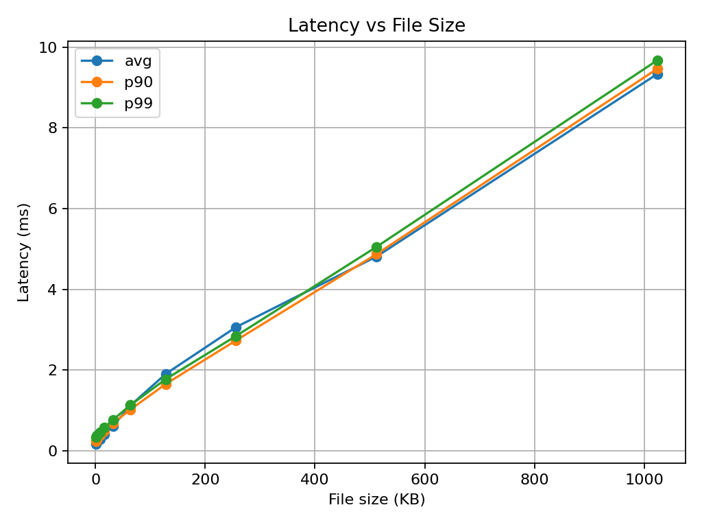
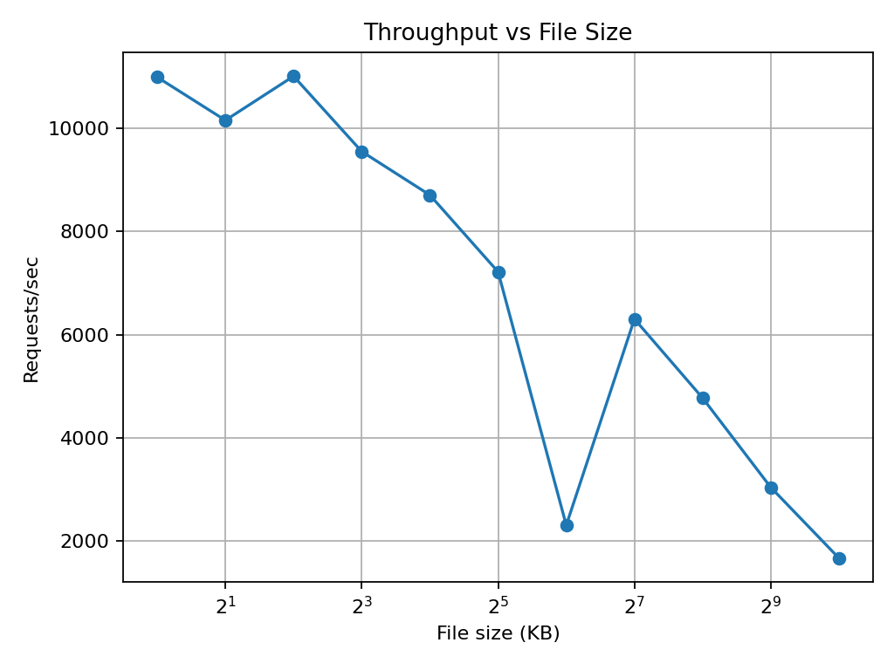

# Forge-C Web Server

Forge is a minimal **NGINX-style** HTTP/1.1 static web server in **C** benchmarked over ethernet (1000Mbps).

## Architecture and Features
- **Master + workers:** a master process with multiple workers.
- **I/O model:** each worker runs a non-blocking **epoll** event loop and registers non-blocking client TCP sockets.
- **Serving static files:** on HTTP GET requests, files are opened, verified, and streamed with **`sendfile()`**.

## Benchmarking
Forge is benchmarked with patched `wrk` over ethernet. **RPS** and **latency** statistics against response payload file size in a **closed-loop** setup is provided.

`Wrk patch`: disabled "coordination ommision compensation (stats_correct())" to reflect raw, unmodified closed loop latency statistics. Stock wrk was adding synthetic latency observations to simulate arrival of requests during large latency spikes in serving pending request. This breaks the closed loop assumption. Patched `wrk` reports unmodified latency statistics.

This behaviour has been discussed by other members such as [upstream wrk issue #485](https://github.com/wg/wrk/issues/485) and [issue #438](https://github.com/wg/wrk/issues/438), which questions the correctness of wrk's coordinated-omission compensation.

## Benchmark Graphs
<table>
  <tr>
    <td align="center"><b>Latency vs Payload Size</b></td>
    <td align="center"><b>RPS vs Payload Size</b></td>
  </tr>
  <tr>
    <td align="center">
      
    </td>
    <td align="center">
      
    </td>
  </tr>
</table>

| file     | size_bytes | rps      | latency_avg_ms | latency_p99_ms |
| -------- | ---------- | -------- | -------------- | -------------- |
| 1k.bin   | 1,024      | 3,259.77 | 0.294          | 0.512          |
| 2k.bin   | 2,048      | 2,527.44 | 0.384          | 0.624          |
| 4k.bin   | 4,096      | 1,705.91 | 1.96           | 53.78          |
| 8k.bin   | 8,192      | 390.69   | 28.00          | 200.22         |
| 16k.bin  | 16,384     | 235.39   | 28.25          | 201.35         |
| 32k.bin  | 32,768     | 125.06   | 28.75          | 206.06         |
| 64k.bin  | 65,536     | 85.99    | 23.78          | 202.17         |
| 128k.bin | 131,072    | 49.04    | 31.24          | 220.44         |
| 256k.bin | 262,144    | 25.39    | 45.45          | 237.55         |
| 512k.bin | 524,288    | 9.66     | 104.37         | 303.06         |
| 1m.bin   | 1,048,576  | 4.06     | 244.15         | 502.81         |


## Quickstart

### Server:
1. Build:

```bash
make
```

2. Spin up server:
```bash
./forge -w 1 -l 0.0.0.0:8080 -r ./public

-w 1                 # one worker
-l 0.0.0.0:8080      # listen on all network interfaces, port 8080
-r ./public          # serve files from ./public
```

3. From the client machine, verify the server is reachable:

```bash
curl -v http://192.168.50.1:8080/1k.bin -o /dev/null
```
### Client:

1. Set up Python environment
```bash
python3 -m venv .venv
source .venv/bin/activate
pip install -r requirements.txt
```
2. Build patched wrk
```
./scripts/build_wrk.sh
```
This builds the vendored patched wrk binary at tools/wrk/wrk

3. Configure benchmark target

Edit scripts/bench.sh and set the server URL/IP:

URL="http://192.168.50.1:8080"


4. Run benchmark
```bash
./scripts/bench.sh
```
This writes benchmark results to perf/baseline.csv

5. Generate plots
```bash
python3 scripts/plot.py
```
